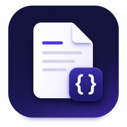
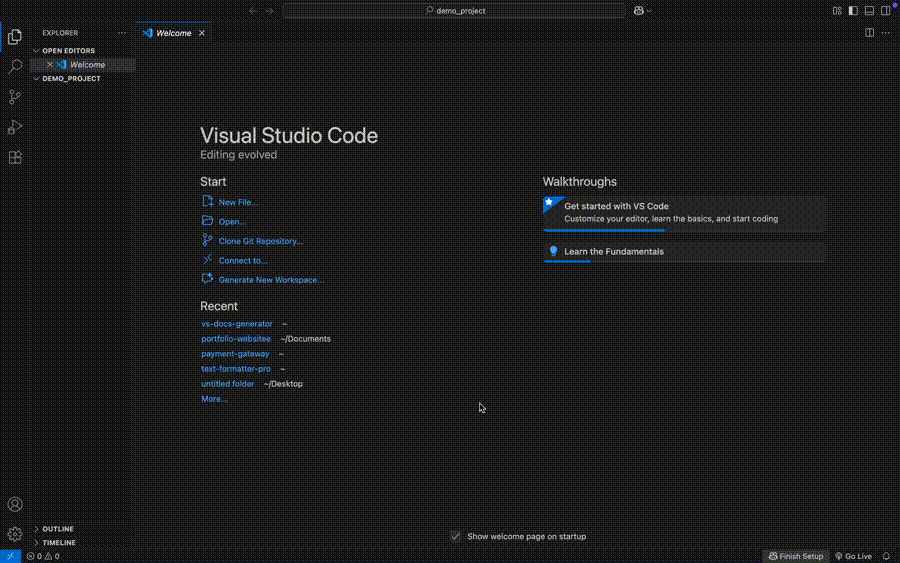

#  VS Documentation Generator


Generate structured Markdown documentation for your projects directly inside Visual Studio Code.



## Overview

VS Documentation Generator is a Visual Studio Code extension that simplifies the process of creating project documentation. It provides ready-to-use Markdown templates for common documentation types, allowing developers to generate structured documents directly within their workspace.

The extension automates repetitive setup tasks by creating a dedicated `/docs` folder, generating the selected documentation template, and opening the file for immediate editing. This helps maintain consistent, organized, and easy-to-manage project documentation.

## Table of Contents

- [Overview](#overview)
- [Features](#features)
- [Supported Templates](#supported-templates)
- [Prerequisites](#prerequisites)
- [Installation](#installation)
- [Usage](#usage)
- [Extension Commands](#extension-commands)
- [Requirements](#requirements)
- [Known Issues](#known-issues)
- [FAQ](#faq)
- [Release Notes](#release-notes)
- [Contributing](#contributing)
- [License](#license)

## Features

- Generate structured Markdown documentation directly within Visual Studio Code
- Preview the document structure before generating files
- Add custom project names to generated documentation
- Automatically create a `/docs` folder in the current workspace
- Generate ready-to-use Markdown documentation templates
- Open generated documentation files automatically for editing
- Work directly within the current Visual Studio Code workspace
- Prevent accidental overwriting of existing documentation files

## Supported Templates

The extension can generate the following Markdown documentation templates:

- README
- Installation Guide
- User Guide
- Technical Overview
- Troubleshooting Guide
- API Documentation
- Release Notes

## Prerequisites

Before using the extension, ensure you have:

- Visual Studio Code installed
- A project folder or workspace opened in Visual Studio Code

## Installation

### Install from the Visual Studio Code Marketplace

1. Open **Visual Studio Code**.
2. Open the **Extensions** view.

   ```text
   Ctrl + Shift + X   (Windows/Linux)
   Cmd + Shift + X    (macOS)
   ```

3. Search for **VS Documentation Generator**.
4. Click **Install**.
5. Open the **Command Palette** and run:

   ```text
   VS Documentation Generator: Open
   ```
   
### Install from a VSIX Package

1. Download the extension's `.vsix` file.
2. Open **Visual Studio Code**.
3. Open the **Extensions** view.
4. Select **More Actions (...) → Install from VSIX...**
5. Choose the downloaded `.vsix` file.
6. Once the installation is complete, run the following command from the **Command Palette**:

   ```text
   VS Documentation Generator: Open
   ```
   
## Usage

1. Open a project folder or workspace in **Visual Studio Code**.
2. Open the **Command Palette**.

   ```text
   Ctrl + Shift + P   (Windows/Linux)
   Cmd + Shift + P    (macOS)
   ```

3. Run the following command:

   ```text
   VS Documentation Generator: Open
   ```

4. Select the documentation template you want to generate.
5. Enter a project name (optional).
6. Click **Generate**.
7. The selected documentation file is created automatically inside the `/docs` folder.
8. The generated Markdown file opens automatically for editing.

## Extension Commands

| Command | Description |
|----------|-------------|
| **VS Documentation Generator: Open** | Opens the documentation generator and allows you to select a documentation template. |

## Requirements

The extension has no additional software or package dependencies.

You only need:

- Visual Studio Code
- An open project folder or workspace.

## Known Issues

There are currently no known issues.

If you find a bug or unexpected behavior, please report it through the project repository.

## FAQ

### Where are generated files saved?

Generated files are created inside the `/docs` folder of the current workspace.

### Which file format is generated?

The extension generates documentation as Markdown (`.md`) files.

### Can I generate multiple documentation files?

Yes. You can generate multiple documentation files using different templates.

### Can I add a custom project name?

Yes. The project name is automatically added to the generated documentation title.

### Will existing documentation files be overwritten?

No. The extension prevents accidental overwriting of existing documentation files.

### Can I edit the generated documentation?

Yes. Generated Markdown files can be edited and customized like any other file in Visual Studio Code.

### Does the extension modify my project files?

No. The extension only creates documentation files inside the `/docs` folder and does not modify your existing source code.

### Do I need an internet connection?

No. The extension works entirely within your local Visual Studio Code environment.

### Does the extension generate complete project documentation automatically?

No. It generates structured Markdown templates that you can customize to match your project's requirements.

## Release Notes

### Version 1.0.0

Initial release featuring:

- Structured Markdown documentation generation
- Multiple documentation templates
- Document structure preview
- Automatic `/docs` folder creation
- Custom project name support
- Automatic opening of generated files
- Overwrite protection for existing documentation files

## Contributing

Contributions are welcome.

If you find a bug, have a feature request, or would like to improve the project, please open an issue or submit a pull request.

## License

This project is licensed under the MIT License. See the [LICENSE](LICENSE) file for more information.
